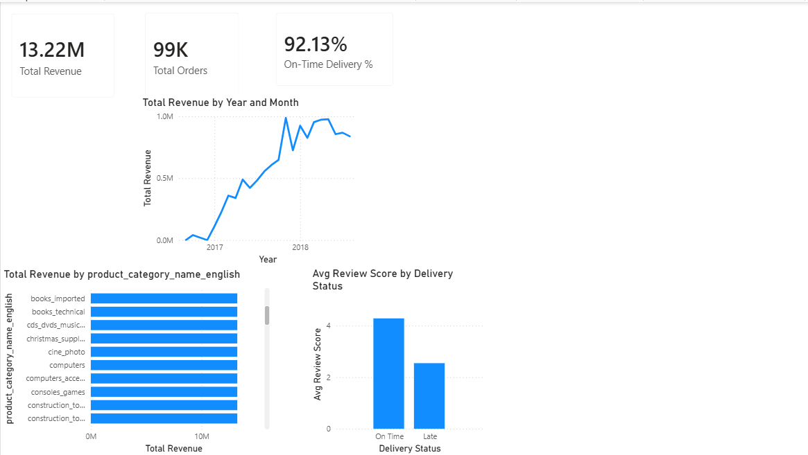

# 🛒 E-Commerce Sales & Delivery Performance Analysis

An end-to-end **Data Analytics and Business Intelligence project** using **SQL, SQLite, Power BI, and DAX** to analyze the Olist Brazilian E-Commerce dataset and transform raw transactional data into actionable business insights.

---

## 📌 Project Overview

This project analyzes the **Olist Brazilian E-Commerce Public Dataset**, containing approximately **99,441 orders** from **September 2016 to October 2018**.

The analysis focuses on:

- Revenue and sales performance
- Monthly revenue trends
- Order volume and Average Order Value (AOV)
- Product category performance
- Customer and state-level analysis
- Delivery performance
- Customer review scores
- Relationship between delivery delays and customer satisfaction
- Business performance indicators

### Project Workflow

```text
Raw E-Commerce Data
        ↓
Data Loading & Preparation
        ↓
Relational Data Model
        ↓
SQL Analysis
        ↓
Business Metrics
        ↓
Power BI Data Model
        ↓
DAX Measures
        ↓
Interactive Dashboard
        ↓
Business Insights
```

---

## 🚀 Key Features

### 💰 Sales Performance Analysis

- Total revenue analysis
- Monthly revenue trends
- Total order analysis
- Average Order Value (AOV)
- Revenue by product category
- Revenue by customer state

### 📦 Product Category Analysis

Identifies the highest-performing product categories and compares category-level revenue and order performance.

The analysis helps identify:

- Top revenue-generating categories
- Category contribution to total revenue
- High-value product segments
- Category performance patterns

### 🚚 Delivery Performance Analysis

Delivery performance is analyzed by comparing:

```text
Actual Delivery Date
        vs
Estimated Delivery Date
```

Orders are classified as:

```text
On Time
Late
```

This allows the project to measure the overall on-time delivery rate and investigate the effect of delivery delays on customer satisfaction.

### ⭐ Customer Satisfaction Analysis

Customer review scores are analyzed and compared between:

```text
On-Time Deliveries
        vs
Late Deliveries
```

This helps identify the relationship between operational performance and customer satisfaction.

### 🗺️ Geographic Analysis

Revenue and order performance are analyzed across Brazilian customer states.

This helps identify:

- High-revenue states
- High-AOV states
- Geographic sales patterns
- Potential market opportunities

---

## 🧠 SQL Analysis

The project includes business-focused SQL queries designed to answer practical e-commerce questions.

### SQL Techniques Used

- Multi-table `JOIN`
- `GROUP BY`
- Aggregate functions
- `HAVING`
- `CASE WHEN`
- Common Table Expressions (CTEs)
- Window functions
- `RANK() OVER()`
- Conditional aggregation
- Customer retention analysis
- Revenue analysis
- Delivery performance analysis

### Example Business Questions

The SQL analysis answers questions such as:

1. What is the total revenue generated?
2. Which product categories generate the most revenue?
3. Which states have the highest Average Order Value?
4. What percentage of orders are delivered on time?
5. Does late delivery affect customer satisfaction?
6. How valuable are repeat customers?
7. Which categories have the highest sales performance?

---

## 📊 Power BI Dashboard

The project includes an interactive **Power BI dashboard** designed to provide an executive-level overview of e-commerce performance.

### KPI Cards

The dashboard includes:

- 💰 **Total Revenue**
- 🛒 **Total Orders**
- 📦 **Average Order Value**
- ⭐ **Average Review Score**
- 🚚 **On-Time Delivery %**

### Dashboard Visualizations

- 📈 Monthly Revenue Trend
- 📊 Top Revenue-Generating Product Categories
- 🗺️ Revenue by Customer State
- ⭐ Review Score: On-Time vs Late Delivery
- 🔎 Interactive Date Filter
- 🔎 State Filter

---

## 🧮 DAX Measures

### Total Revenue

```DAX
Total Revenue =
CALCULATE(
    SUM(olist_order_items_dataset[price]),
    olist_orders_dataset[order_status] = "delivered"
)
```

### Total Orders

```DAX
Total Orders =
DISTINCTCOUNT(olist_orders_dataset[order_id])
```

### Average Order Value

```DAX
Avg Order Value =
DIVIDE(
    [Total Revenue],
    [Total Orders]
)
```

### Average Review Score

```DAX
Avg Review Score =
AVERAGE(olist_order_reviews_dataset[review_score])
```

### On-Time Delivery %

```DAX
On-Time Delivery % =
DIVIDE(
    CALCULATE(
        COUNTROWS(olist_orders_dataset),
        olist_orders_dataset[order_delivered_customer_date]
            <= olist_orders_dataset[order_estimated_delivery_date]
    ),
    COUNTROWS(olist_orders_dataset)
)
```

---

## 🔧 Calculated Columns

A calculated column was created to classify delivery performance.

```DAX
Delivery Status =
IF(
    ISBLANK(olist_orders_dataset[order_delivered_customer_date]),
    BLANK(),
    IF(
        olist_orders_dataset[order_delivered_customer_date]
            > olist_orders_dataset[order_estimated_delivery_date],
        "Late",
        "On Time"
    )
)
```

This column is used to compare customer review scores between on-time and late deliveries.

---

## 📈 Key Business Insights

The analysis produced several important findings:

- Approximately **$13.2M revenue** was generated from delivered orders.
- Around **91.9% of orders were delivered on time**.
- Late deliveries were associated with significantly lower customer review scores.
- **Health & Beauty** was one of the highest-revenue product categories.
- **Watches & Gifts** showed a high Average Order Value.
- Repeat customers generated substantially higher lifetime value than one-time customers.
- Some states showed high average order values despite relatively lower order volumes.

### Business Opportunities

These findings highlight opportunities related to:

- 🚚 Delivery optimization
- 👥 Customer retention
- 📦 Product category strategy
- ⭐ Customer satisfaction
- 📈 Revenue growth

---

## 🗂️ Dataset

The project uses the **Olist Brazilian E-Commerce Public Dataset**.

The dataset contains approximately **99K orders** and includes information about:

- Customers
- Orders
- Products
- Sellers
- Payments
- Reviews
- Product categories

### Main Tables

```text
customers
orders
order_items
order_payments
order_reviews
products
sellers
category_translation
```

### Dataset Time Period

```text
September 2016
      ↓
October 2018
```

The dataset contains anonymized e-commerce transaction information.

---

## 🏗️ Data Model

The project uses a relational data model connecting transactional and master data.

```text
Customers
    │
    ▼
Orders
    │
    ├──────────────► Order Items
    │                    │
    │                    ├────────► Products
    │                    │
    │                    └────────► Sellers
    │
    ├──────────────► Order Payments
    │
    └──────────────► Order Reviews

Products
    │
    ▼
Category Translation
```

### Main Relationships

| From | To | Relationship |
|---|---|---|
| `orders[order_id]` | `order_items[order_id]` | One-to-Many |
| `orders[order_id]` | `order_payments[order_id]` | One-to-Many |
| `orders[order_id]` | `order_reviews[order_id]` | One-to-Many |
| `orders[customer_id]` | `customers[customer_id]` | Many-to-One |
| `order_items[product_id]` | `products[product_id]` | Many-to-One |
| `order_items[seller_id]` | `sellers[seller_id]` | Many-to-One |
| `products[product_category_name]` | `category_translation[product_category_name]` | Many-to-One |

---

## 📸 Dashboard Preview



---

## 📁 Project Structure

```text
ecommerce-sales-delivery-analysis/
│
├── Ecommerce_Sales_Dashboard.pbix
├── queries.sql
├── dashboard_screenshot.png
├── README.md
└── .gitignore
```

---

## 📄 File Responsibilities

| File | Purpose |
|---|---|
| `Ecommerce_Sales_Dashboard.pbix` | Interactive Power BI dashboard |
| `queries.sql` | Business-focused SQL analysis queries |
| `dashboard_screenshot.png` | Dashboard preview for GitHub |
| `README.md` | Project documentation |
| `.gitignore` | Prevents unnecessary/local files from being uploaded |

---

## ▶️ How to Rebuild the Project

### 1. Download the Dataset

Download the Olist Brazilian E-Commerce dataset and extract the CSV files.

### 2. Load Data into Power BI

Open **Power BI Desktop**:

```text
Get Data
   ↓
Text/CSV
   ↓
Select CSV files
   ↓
Load
```

Import the required tables into Power BI.

### 3. Create Relationships

Open **Model View** and establish the relationships listed in the Data Model section.

### 4. Create DAX Measures

Create the required DAX measures listed in the DAX Measures section.

### 5. Create the Dashboard

Build the following visuals:

```text
KPI Cards
    ↓
Monthly Revenue Trend
    ↓
Top Product Categories
    ↓
Revenue by State
    ↓
On-Time vs Late Review Score
```

### 6. Apply Filters

Add interactive slicers for:

- Date
- Customer State

### 7. Save the Power BI File

Save the project as:

```text
Ecommerce_Sales_Dashboard.pbix
```

---

## 🛠️ Technologies Used

### Data Analytics

- Data Cleaning
- Exploratory Data Analysis
- Business Analysis
- Data Modeling

### SQL

- Joins
- Aggregations
- CTEs
- CASE statements
- HAVING
- Window Functions
- Ranking

### Power BI

- Power BI Desktop
- Data Modeling
- Interactive Dashboards
- KPI Cards
- Bar Charts
- Line Charts
- Filters and Slicers

### DAX

- Measures
- Calculated Columns
- Conditional Calculations
- KPI Calculations

### Database

- SQLite
- Relational Data Modeling

---

## ⚠️ Limitations

- The analysis is based on historical Olist marketplace data.
- The dataset does not represent the entire Brazilian e-commerce market.
- Customer behavior insights depend on the available transaction history.
- Delivery performance depends on the recorded delivery and estimated delivery dates.
- The dashboard is not connected to live e-commerce data.
- Revenue calculations focus on delivered orders where specified.

---

## 🔮 Future Improvements

Possible future enhancements include:

- 🌐 Real-time e-commerce data integration
- 📈 Automated Power BI refresh
- 🤖 Sales forecasting
- 📦 Demand forecasting
- 👥 Customer churn prediction
- 🎯 Customer segmentation using clustering
- 💰 Profit and margin analysis
- 🚚 Delivery-time prediction
- 📍 Advanced geographic analysis
- 🧠 Customer lifetime value modeling
- 📊 Automated business reporting
- 🗄️ Cloud data warehouse integration

---

## 🎯 Business Objectives

The primary objective of this project is to demonstrate how raw e-commerce data can be transformed into actionable business intelligence.

The project helps answer:

- What are the major revenue trends?
- Which products and categories perform best?
- Which regions generate the most revenue?
- How efficient is the delivery process?
- Does late delivery affect customer satisfaction?
- Which areas provide opportunities for business improvement?

---

## 🎓 Skills Demonstrated

### Data Analytics

Data Cleaning · EDA · Business Analysis · Data Modeling

### SQL

Joins · CTEs · Aggregations · CASE · HAVING · Window Functions · Ranking

### Power BI

Data Modeling · Dashboard Development · KPI Cards · Data Visualization · Slicers

### DAX

Measures · Calculated Columns · Conditional Logic · KPI Analysis

### Business Intelligence

Sales Analysis · Customer Analysis · Product Analysis · Delivery Performance · Customer Satisfaction

---

## 📌 Project Outcome

This project demonstrates an end-to-end analytics workflow, from **raw e-commerce data and SQL analysis to data modeling, DAX calculations, Power BI visualization, and business insights**.

It showcases practical skills relevant to **Data Analyst, Business Intelligence Analyst, and Data Analytics roles** by transforming complex transactional data into an interactive and decision-oriented dashboard.

---

## 📜 License

This project is intended for educational and portfolio purposes.

The Olist dataset is publicly available and subject to its original dataset terms and conditions.


👩‍💻 **Author**

Palak Kumain

BCA — Artificial Intelligence & Data Science
